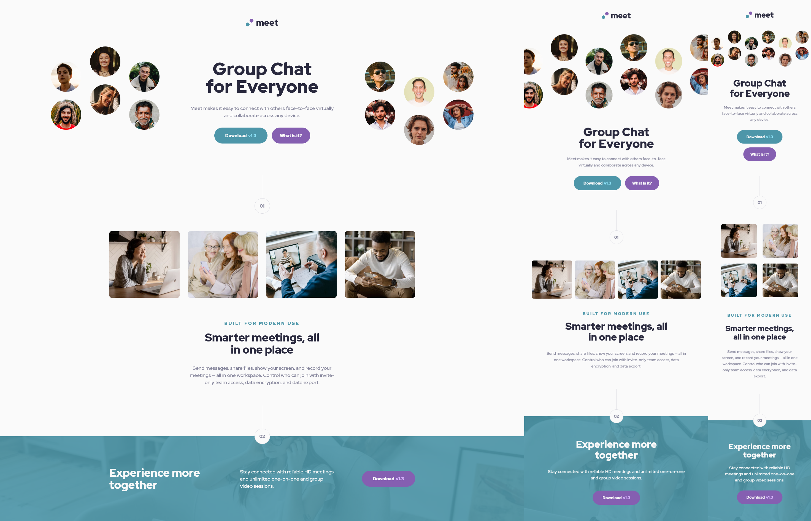

# Frontend Mentor - Meet landing page solution

This is a solution to the [Meet landing page challenge on Frontend Mentor](https://www.frontendmentor.io/challenges/meet-landing-page-rbTDS6OUR). Frontend Mentor challenges help you improve your coding skills by building realistic projects. 

## Table of contents

- [Overview](#overview)
  - [Screenshot](#screenshot)
  - [Links](#links)
- [My process](#my-process)
  - [Built with](#built-with)
  - [What I learned](#what-i-learned)
  - [Continued development](#continued-development)
  - [Useful resources](#useful-resources)
- [Author](#author)

## Overview

### Screenshot

### Links

- Solution URL: [Add solution URL here](https://github.com/LuisCBeltran/meet-landing-page)
- Live Site URL: [Add live site URL here](https://luiscbeltran.github.io/meet-landing-page/)

## My process

### Built with

- Semantic HTML5 markup
- Flexbox
- CSS Grid
- Mobile-first workflow
- Sass
- Pug

### What I learned

- Use of mixins and variables in a responsive design.
- Consolidation and practice of current CSS/Sass and HTML knowledge. 

### Continued development

This was a real challenge for current skills. Nevertheless, I need to practice more because I am currently too slow coding. With more practice I will consolidate the knowledge that I have built. I think it is time begin more in depth studies in JavaScript. 

### Useful resources

- [Fácil y rápido diseño responsivo – Mixin media querie :D – SASS/SCSS](https://www.youtube.com/watch?v=1334bFDilgk&list=LL&index=1&t=307s) - This video helped me on how to use mixins in a resposive design environment (in Spanish).

## Author

- Website - [Luis C. Beltrán](https://github.com/LuisCBeltran)
- Frontend Mentor - [@LuisCBeltran](https://www.frontendmentor.io/profile/LuisCBeltran)
- Twitter - [@luisc_beltran](https://twitter.com/luisc_beltran)
